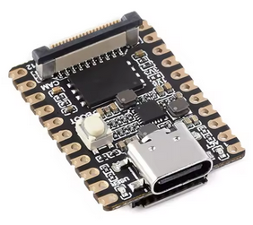
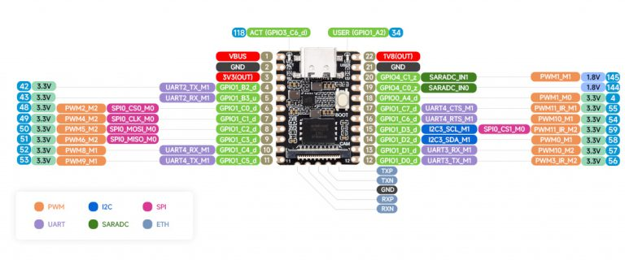
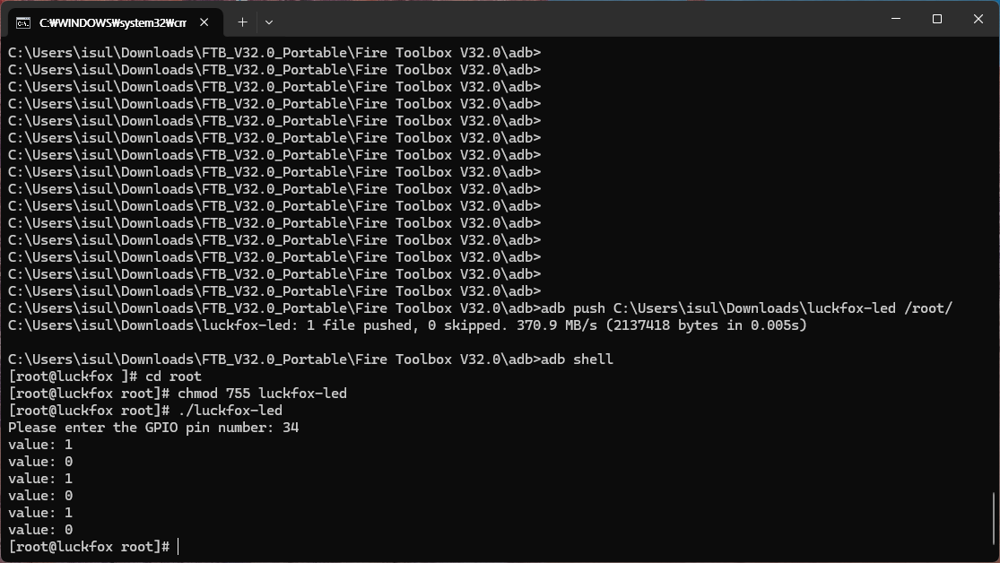

# luckfox-pico-mini-led
GPIO control program in go


## gpio
port 34


## features
This program shows you how to control GPIOs.
After running the program, enter the GPIO number (34) that the User LED is connected to and the LED will blink three times.

## build

# windows
```text
set GOOS=linux
set GOARCH=arm
set OARM=7
go build -o luckfox-led main.go
```

# linux
```text
GOOS=linux GOARCH=armG OARM=7 go build -o luckfox-led main.go
```

## quick start
```text
adb push luckfox-led /root/
adb shell
cd /root/
chmod 755 luckfox-led
./luckfox-led
```

## screenshots

